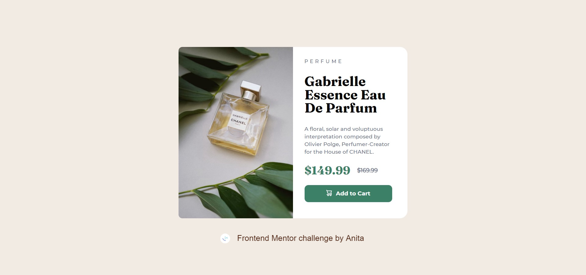

# Frontend Mentor - Product preview card component solution

This is a solution to the [Product preview card component challenge on Frontend Mentor](https://www.frontendmentor.io/challenges/product-preview-card-component-GO7UmttRfa). Frontend Mentor challenges help you improve your coding skills by building realistic projects. 

## Table of contents

- [Overview](#overview)
  - [The challenge](#the-challenge)
  - [Screenshot](#screenshot)
  - [Links](#links)
- [My process](#my-process)
  - [Built with](#built-with)
  - [What I learned](#what-i-learned)
  - [Continued development](#continued-development)
  - [Useful resources](#useful-resources)
- [Author](#author)
- [Acknowledgments](#acknowledgments)

**Note: Delete this note and update the table of contents based on what sections you keep.**

## Overview

### The challenge

Users should be able to:

- View the optimal layout depending on their device's screen size
- See hover and focus states for interactive elements

### Screenshot



### Links

- Solution URL: [Add solution URL here](https://your-solution-url.com)
- Live Site URL: [Add live site URL here](https://your-live-site-url.com)

## My process
I started by creating the html template then i worked my way through to CSS. I initially used mobile first approach but i got confused on the way so i switched over to desktop first. After creating the desktop first, i encountered some problems using the @media-query screen size =(min-width:375px); so i had to use the tablet size which (max-width:620px), still having the mobile size in mind.
### Built with

- Semantic HTML5 markup
- CSS custom properties
- Flexbox
- desktop-first workflow

### What I learned

i learnt a great to use image property object fit. I also learnt how to properly structure my html codes. i didnt use much of html semantic because i havent quite mastered it but i will make sure to implement it in my next design.
i also learnt how to center div element. i learnt how to make web project responsive.

``css
.img2{
    display:block;
    object-fit: cover; 
}
To see how you can add code snippets, see below:

```

If you want more help with writing markdown, we'd recommend checking out [The Markdown Guide](https://www.markdownguide.org/) to learn more.


### Continued development

I would definitely love to focus more on media queries, i havent quite mastered it. Also, i would like to improve on perfectly centering a div. These were my major challenges. i would focus on using html semantics in my project for SEO purposes. 

### Useful resources

- [Example resource 1](https://www.youtube.com/c/ThuNghiem) - This gave the idea on how to create a card. I really liked this pattern and will use it going forward.

[Example resource 1](https://www.youtube.com/watch?v=PM3XW_1RAIs&list=PL4cUxeGkcC9hH1tAjyUPZPjbj-7s200a4) - This gave the idea on how to use mobile first approach. I really liked this pattern and will use it going forward.


## Author

- Website - [Add your name here](https://www.your-site.com)
- Frontend Mentor - [@neetauka](https://www.frontendmentor.io/profile/neetauka)
- Twitter - [@Anitauka3](https://www.twitter.com/Anitauka3)


## Acknowledgments
i want to acknowledge my mentor for coming through when i encountered difficulty trying to use font. I also want to thank my friend, Emmanuel who taught me the importance of properly structuring my codes. Above all, i Want to thank Holy spirit who led me through the completion of the project. i wouldnt have done it without him.


